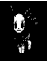
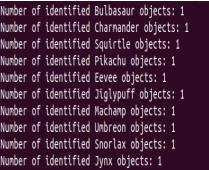
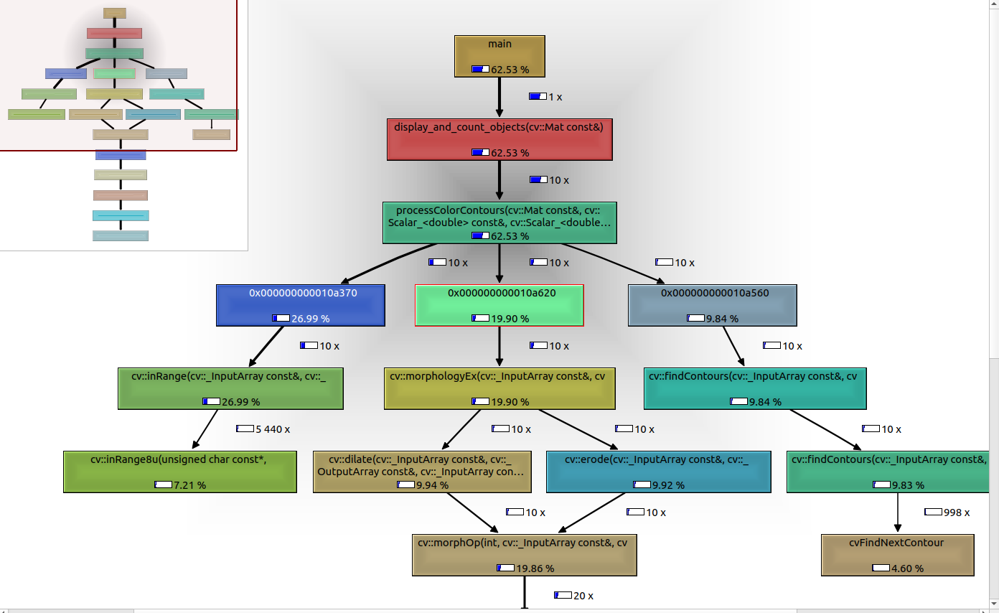
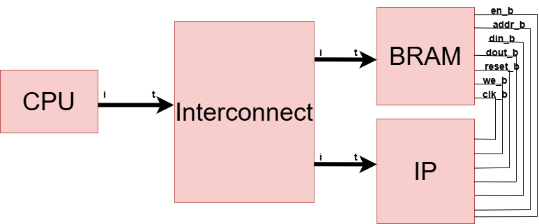
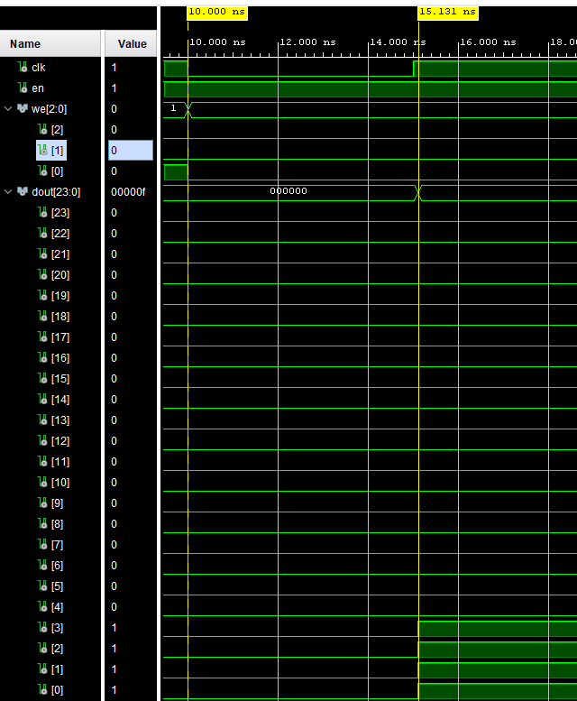
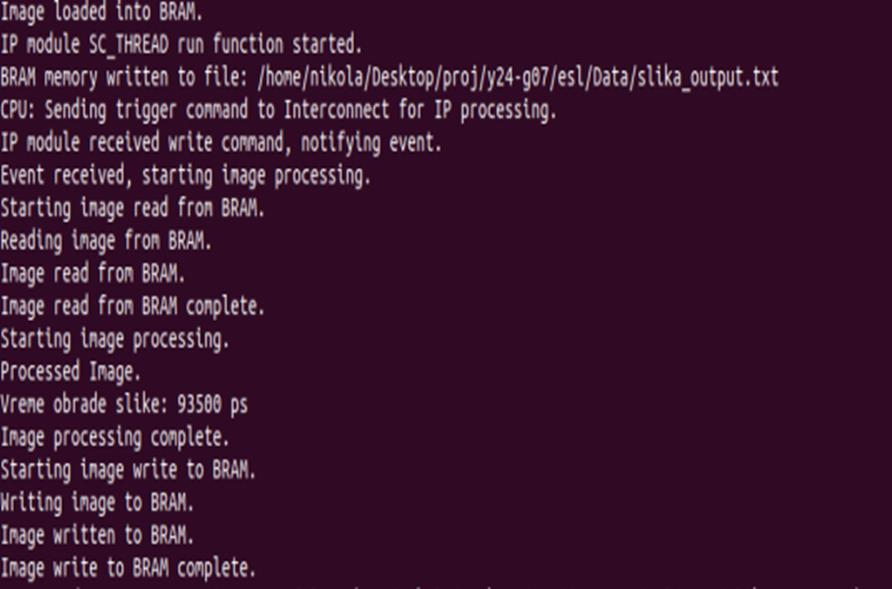

> **PROJEKAT**
>
> **iz** **Projektovanje** **elektronskih** **uređaja** **na**
> **sistemskom** **nivou**
>
> **TEMA** **PROJEKTA:** Prepoznavanje objekata na slici
>
> **MENTOR** **PROJEKTA:** Nebojša Pilipović
>
> **PROJEKAT** **IZARDILI:** Nikola Kovačić EE 77/2020 Ognjen Višnjic EE
> 217/2020
>
> U Novom Sadu, datum
>
> **Sadržaj**
>
> 1\.
> Uvod.......................................................................................................................3
> 2. Specifikacija
> ...........................................................................................................3
> 2.1 Učitavanje
> slike....................................................................................................3
> 2.2 Segmentacija boja
> ................................................................................................4
> 2.3 Morfološka
> operacija............................................................................................4
> 2.4 Detekcija
> kontura.................................................................................................4
> 2.5 Filtriranje i označavanje
> objekata.........................................................................4
> 2.6 Prikaz
> rezultata................................................................................................5
>
> 3\.
> Profiling..................................................................................................................5
> 3.1 Valgrind
> analiza...................................................................................................5
> 3.2
> Optimizacija.........................................................................................................6
>
> 4\. Virtualna
> platforma.................................................................................................7
> 4.1
> CPU.....................................................................................................................7
> 4.2 Interconnect
> .........................................................................................................7
> 4.3
> BRAM.................................................................................................................7
> 4.4 IP
> modul..............................................................................................................7
> 4.5 Opis rada virtualne
> platforme...............................................................................8
>
> 5\. Bitska
> analiza..........................................................................................................9
> 6. HLS sinteza
> ..........................................................................................................10
> 7.
> Zaključak..............................................................................................................13
> 8.
> Literatura..............................................................................................................14
>
> 2
>
> **1.** **Uvod**

Ovaj projekat se fokusira na razvoj naprednog softverskog rešenja za
identifikaciju, brojanje i označavanje objekata na osnovu boje na
digitalnim slikama. Specifično, program koristi algoritme za
segmentaciju zasnovanu na boji, morfološke operacije i detekciju kontura
za efikasno prepoznavanje i označavanje objekata. Projekat cilja na
specifičnu primenu u kontekstu prepoznavanja 10 različitih Pokemon
karaktera, svaki definisan jedinstvenim spektrom boja, što omogućava
njihovo precizno identifikovanje i kvantifikaciju na slikama.
Segmentacija zasnovana na boji je prvi korak u procesu prepoznavanja
objekata. U ovom koraku, algoritam koristi unapred definisane opsege
boja za svaku klasu objekata koje treba prepoznati. Na osnovu tih
opsega, svaki piksel na slici se klasifikuje kao deo objekta ili kao
pozadina. Ovo se postiže jednostavnim poređenjem vrednosti boja piksela
sa unapred definisanim donjim i gornjim granicama boje. Nakon
segmentacije, algoritam primenjuje morfološke operacije na dobijenu
binarnu masku slike kako bi se poboljšao kvalitet segmentacije. Dve
glavne morfološke operacije koje se koriste su dilatacija i erozija. Po
završetku primene morfoloških operacija, algoritam koristi tehniku
detekcije kontura kako bi pronašao obode objekata na binarnoj slici.
Konture su sami krajevi objekata, i njihovom detekcijom algoritam može
da identifikuje različite objekte na slici.

Program je posebno koristan u aplikacijama poput automatizovane analize
slika, gde brzo prepoznavanje i brojanje objekata može poboljšati
efikasnost i tačnost obrade. Na primer, u video igricama ili mobilnim
aplikacijama gde interakcija sa Pokemonima ima ključnu ulogu, ovakav
program može automatski analizirati i pružiti povratne informacije
korisnicima u realnom vremenu.

Ipak, potrebno je naglasiti da program ima ograničenja, kao što su
sposobnost prepoznavanja samo unapred definisanih 10 Pokemona i potreba
za tačnim definisanjem opsega boja, što može biti izazov u slučaju
varijacija u svetlosnim uslovima ili promena boja objekata. Ova
ograničenja ukazuju na moguće oblasti za dalji razvoj i poboljšanje
sistema.

> .
>
> **2.** **Specifikacija**

Ovaj deo dokumentacije opisuje tehničke detalje implementacije programa
za identifikaciju i brojanje objekata na slikama. Program je
implementiran u C++ koristeći OpenCV biblioteku. Svaka funkcija i metoda
u kodu igra specifičnu ulogu u procesu identifikacije i brojanja
objekata na slikama. U nastavku će biti dato detaljno objašnjenje svake
upotrebljene tehnike i funkcije u programu.

> **2.1** **Učitavanje** **slike**

Proces počinje učitavanjem slike u program koristeći funkciju
**cv::imread** iz OpenCV biblioteke. Ova funkcija omogućava učitavanje
slike u strukturu podataka **cv::Mat**, koja predstavlja matričnu
strukturuslike. Argument **cv::IMREAD\_*COLOR*** koristise za učitavanje
slike u boji, kao 3-kanalna slika (BGR - plava, zelena i crvena).

Ovaj korak je bitan za sve kasnije faze obrade slike, jer kvalitet i
format učitane slike direktno utiču narezultatesegmentacije idetekcije
objekata. Trebaosiguratidaputanjado slike bude ispravno definisana i da
format slike bude podržan od strane OpenCV-a.

> 3

> **2.2** **Segmentacija** **boja**

Za izolaciju objekata od interesa na osnovu boje koristi se funkcija
**cv::inRange**. Ova funkcija proverava da li vrednosti svakog piksela u
slici spadaju u definisani opseg boja i generiše binarnu masku gde
pikseli unutar opsega imaju vrednost 1 (belo), dok ostali imaju vrednost
0 (crno). Ova binarna maska omogućava dalju obradu samo relevantnih
delova slike. Ako želimo preciznije rezultate, boje se često konvertuju
iz RGB u HSV (Hue, Saturation, Value) model, jer HSV omogućava bolje
razlikovanje nijansi boja.

> *Slika* *1,* *Izgled* *binarne* *maske*
>
> **2.3** **Morfološka** **operacija**

Nakon kreiranja početne maske, primenjuje se morfološka operacija
zatvaranja kako bi se popunile rupe unutar identifikovanih objekata i
obuhvatile njihove konture. Za ovaj korak koristi se funkcija
**cv::morphologyEx** zajedno sa **cv::getStructuringElement**, koja
kreira strukturni element koji je potreban za izvršavanje morfološke
operacije. Specifično, koristi se **cv::MORPH_CLOSE** zaoperaciju
zatvaranja, koja je kombinacija dilatacije (širenje objekta) i erozije
(smanjenje objekta).

> **2.4** **Detekcija** **kontura**

Detekcija kontura vrši se pomoću funkcije **cv::findContours**, locira
granice objekata unutar binarne maske. Mod **cv::RETR_EXTERNAL**
uključuje samo vanjske konture, što je korisno za izbegavanje dupliranja
u hijerarhiji kontura. **cv::CHAIN_APPROX_SIMPLE** smanjuje broj
potrebnih tačaka za opis konture, čime se štedi memorija.

> **2.5** **Filtriranje** **i** **označavanje** **objekata**

Za svaku identifikovanu konturu, program proverava da li kontura
zadovoljava određene kriterijume veličine i oblika koristeći OpenCV
funkcije kao što su **cv::contourArea** za izračunavanje površine
konture i **cv::boundingRect** za pronalaženje pravougaonika koji
obuhvata konturu. Objekti koji zadovoljavaju kriterijume zatim se
označavaju na originalnoj slici koristeći funkcije **cv::rectangle** za
crtanje pravougaonika i **cv::putText** za dodavanje tekstualnih oznaka,
da znamo koji Pokemon je u pitanju.

> 4

> **2.6** **Prikaz** **rezultata**

Na kraju, koristi se funkcija **cv::imshow** za prikazivanje obrađene
slike sa označenim objektima, kao imaskikojesu
korištenetokomprocesasegmentacije. Ova funkcijaomogućava da vizuelno
procenimo rezultate obrade.

> *Slika* *2,* *Prikaz* *konačnog* *rezultata* *programa*

Takođe, postoji i standardni izlaz, **std::cout**, za ispisivanje
preciznog broja identifikovanih objekata po kategorijama.

> *Slika* *3,* *Ispis* *broja* *indentifikovanih* *Pokemona*
>
> **3.** **Profiling**
>
> **3.1** **Valgrind** **analiza**

Za analizu performansi našeg softverskog rešenja koristili smo alat
Valgrind, specifično njegovu komponentu za profiling zvanu Callgrind.
Callgrind nam omogućava da dobijemo detaljne informacije o CPU vremenu i
broju instrukcija koje se izvršavaju za svaku funkciju unutar našeg
koda.

> Nakon završetka sesije profiling-a, dobili smo grafički prikaz
> rezultata.
>
> 5

> *Slika* *4,* *Grafički* *prikaz* *rezultata* *u* *Valgrind* *alatu*

Analiza je pokazala da funkcija **processColorContours** dominira u
potrošnji resursa, čineći 62.53% ukupnog vremena izvršavanja. Unutar ove
funkcije, najzahtevniji pozivi su:

> • **cv::inRange** sa 26.99% koja se koristi za segmentaciju boja,
>
> • **cv::morphologyEx** sa 19.90% koja primenjuje morfološke operacije,
> • **cv::findContours** **sa** 8.94% koja detektuje konture objekata.
>
> **3.2** **Optimizacija**

U cilju poboljšanja efikasnosti i preciznosti ovog programa,
implementirane su značajne optimizacije u funkciji
**processColorContours**. Ova optimizacija se fokusira na unapređenje
segmentacije boja, morfoloških operacija i detekcije kontura.

Prvobitno, korištenesu standardneOpenCV funkcije zaobradu slika, kojesu
bileefikasne, ali nisu pružale potrebnu brzinu obrade. Optimizacija je
uvedena u obliku prilagođenog algoritma koji direktno manipuliše
pikselima slike.

Ručna segmentacija boja zamjenjuje standardnu funkciju **cv::inRange**.
Algoritam prolazi kroz svaki piksel slike, uzimajući u obzir njegove
boje u RGB formatu. Za svaki piksel, algoritam proverava da li se
njegove boje nalaze unutar zadatog opsega koji opisuje ciljani objekat.
Ovo se radi poređenjem svake boje (crvena, zelena, plava) sa donjom i
gornjom granicom opsega. Pikseli koji zadovoljavaju kriterijume boje se
označavaju kao deo objekta, dok se ostali pikseli ignorišu, što smanjuje
mogućnost neispravnih detekcija. Ovakav pristup mogućava detaljniju
segmentaciju u definisanju šta čini objekat, smanjujući broj grešaka u
identifikaciji i otporniji je na promene u osvetljenju i boji pozadine.

Umesto standardnih OpenCV funkcija za dilataciju (**cv::dilate**) i
eroziju (**cv::erode**), koristen je proces ručnih morfoloških
operacija. Prvo se proširuju svetle regije na slici ručnim

> 6

postavljanjem piksela u neposrednom okruženju svakog detektovanog
piksela objekta na maksimalnu vrednost, jer je korisno za povezivanje
prekunutih delova objekata. Zatim te iste regije su sužavane uklanjanjem
piksela sa ivica objekata ako okolni pikseli nisu takođe deo objekta.

Funkcija **cv::findContours** zamenjena je algoritmom koji pruža
preciznije praćenje oboda objekata na slici, omogućavajući bolje
razlikovanje između objekata i pozadine. Algoritam započinje
identifikacijom početne tačke za traganje kontura, što se obično vrši
lociranjem piksela gde dolazi do značajnih promena u boji ili
intenzitetu svetlosti. Nakon postavljanja početne tačke, algoritam
sistematski ispituje susedne piksele kako bi utvrdio da li i oni
pripadaju istoj konturi. Svaki piksel koji zadovoljava ove kriterijume
se dodaje u lanac konture. Pikseli koji su kandidati za pripadnost
konturi se stavljaju na stek. Za svaki piksel koji se ispituje,
algoritam takođe proverava da li svi susedni pikseli u neposrednoj
okolini pripadaju konturi. Ovaj korak osigurava da je kontura potpuna i
da ne postoje prekidi unutar granica objekta.

> **4.** **Virtualna** **platforma**

Virtualna platforma ovog programa predstavlja sistem dizajniran za
simulaciju i obradu slika, koristeći SystemC i TLM (Transaction Level
Modeling) za modelovanje i interakciju između različitih komponenata.
Ova platforma je izgrađena sa četiri osnovne komponente: CPU,
Interconnect, BRAM, i IP modul, koje zajedno omogućavaju efikasno
upravljanje i obradu slika od njihovog učitavanja do finalne obrade i
skladištenja.

> **4.1** **CPU**

CPU modul služi kao centralna kontrolna jedinica koja upravlja tokom
podataka unutar sistema. On učitava slike sa specifičnih lokacija i
šalje podatke preko TLM transakcija do Interconnect-a, koji dalje
usmerava te podatke prema odgovarajućim modulima.

> **4.2** **Interconnect**

Rukuje transakcijama između CPU, IP, i BRAM. Zaslužan je za usmeravanje
podataka između modula. On prima transakcije od CPU-a i na osnovu vrste
transakcije usmerava ih ili ka BRAM-u za skladištenje ili ka IP modulu
za obradu. Interconnect koristi *target* i *initiator* *sockete* kako bi
omogućio komunikaciju između povezanih modula.

> **4.3** **BRAM**

BRAM služi kao memorija sistema, gde se skladište slike koje CPU učita.
Ovaj modul omogućava IP modulu pristup učitanim slikama, kao i
skladištenje obrađenih slika nazad u memoriju.

> **4.4** **IP** **modul**

Predstavlja modul za obradu slika koji čita podatke iz BRAM-a, vrši
njihovu obradu koristeći algoritme detekcije i obradu slika, i vraća
obradjene slike nazad u BRAM.

> 7

> **4.5** **Opis** **rada** **virtualne** **platforme**

Proces počinje kada CPU učita digitalnu sliku iz zadatog fajla. Ova
slika se nalazi na putanji koju specificira korisnik kada pokreće
simulaciju. CPU modul, koristeći svoj TLM *initiator* *socket*, pakuje
podatke slike u TLM transakcije i šalje ih prema Interconnect modulu.
Kada Interconnect primipodatkeod CPU-a,on identifikuje prirodu
transakcije iusmerava podatke prema BRAM modulu za skladištenje.
Interconnect deluje kao posrednik, upravljajući komunikacijom ne samo
prema BRAM-u već i prema IP modulu kada je potrebno. Ovo uključuje
slanje signala za kontrolu i podataka preko svojih *initiator* *socketa*
koji su povezani

sa odgovarajućim *target* soketima na BRAM i IP modulima.

BRAM modul prima slike putemTLM transakcija i skladišti ih u svojoj
memoriji. BRAM takođe omogućava IP modulu pristup ovim podacima kada
počne proces obrade.

Nakon što su podaci slike bezbedno skladišteni u BRAM-u, IP modul
pokreće svoj algoritam za obradu slika. Ovo uključuje čitanje podataka
slike iz BRAM-a, kao i njihovu obradu. Nakonobrade, IP modul šalje
procesuiranu sliku nazad u BRAM. Ovaj korak može da uključuje različite
obrade kao što su promena kontrasta, otkrivanje ivica, segmentacija
boja, ili identifikacija i brojanje određenih objekata na slici.

Procesuirana slika se zapisuju nazad u BRAM odakle može bitipreuzeta za
dalju upotrebu ili analizu. Na kraju procesa, BRAM može izvesti ovu
sliku u tekstualne fajlove ili je direktno prikazati, zavisno od potreba
korisnika.

Nakon što su svi podaci obrađeni i odgovarajući izlazi generisani,
simulacija se završava, a rezultati obrade su dostupni za dalju analizu.
Platforma omogućava detaljnu analizu broja detektovanih objekata za
svaku vrstu Pokemona.

> *Slika* *5,* *Blok* *šema* *virtualne* *platforme*
>
> 8
>
> **5.** **Bitska** **analiza**

U ovoj analizi prikazujemo broj bitova korišćenih za različite
promenljive u kodu, sa ciljem da identifikujemo trenutnu potrošnju
memorije i performanse sistema.

CPU je zadužen za učitavanje slike i pokretanje procesa obrade. Koristi
**std::string** za čuvanje putanje do slike, pri čemu veličina zavisi od
dužine putanje (obično 8 bitova po karakteru).

BRAM skladišti podatke slike. Svaki piksel slike predstavljen je sa tri
**unsigned** **char** vrednosti (za plavu, zelenu i crvenu komponentu),
gde svaki unsigned char zauzima 8 bitova. Dimenzije slike (visina i
širina) čuvaju se kao **short** vrednosti, svaki zauzimajući 16 bitova.
BRAM koristi TLM target soket za komunikaciju, i SystemC signale za
kontrolu i adresiranje, pri čemu ovi signali zauzimaju 1 bit ili 64
bitova u slučaju adrese. Podaci ulaza i izlaza zauzimaju 8 bitova po
elementu (24 bitova ukupno za tri komponente boje).

IP je odgovoran za obradu slike. Sadrži dimenzije slike, svaki
zauzimajući 16 bitova, kao i brojače objekata za različite tipove
objekata, svaki zauzimajući 16 bitova. IP modul koristi TLM target soket
za komunikaciju i signale za kontrolu, pri čemu ovi signali zauzimaju 1
bit ili 64 bitova u slučaju adrese. Podaci ulaza i izlaza zauzimaju 8
bitova po elementu (24 bitova ukupno za tri komponente boje).

**short** **img_height,** **img_width** **-** Širina 16 bitova
svaki**,** koriste se za skladištenje visine i širine slike u pikselima.

**short** **objects_count\_\*** - 16 bitova svaki, brojači za različite
tipove objekata (Pokemona) detektovanih na slici.

**unsigned** **char** **memory\[\]** - 8 bitova po elementu, skladišti
podatke o slici u BRAM memoriji. Svaki piksel slike je predstavljen sa
tri unsigned char vrednosti (za plavu, zelenu i crvenu komponentu).

**sc_core::sc_signal\<bool\>** **en_b_signal** - 1 bit, signal koji
omogućava pristup BRAM memoriji.

**sc_core::sc_signal\<sc_dt::uint64\>** **addr_b_signal** - 64 bitova,
signal koji predstavlja adresu u BRAM memoriji.

**sc_core::sc_signal\<unsigned** **char\>** **din_b_signal\[3\]** **-**
8 bitova po elementu, signali za unos podataka u BRAM (za plavu, zelenu
i crvenu komponentu piksela).

**sc_core::sc_signal\<unsigned** **char\>** **dout_b_signal\[3\]** **-**
8 bitova po elementu, signali za izlaz podataka iz BRAM (za plavu,
zelenu i crvenu komponentu piksela).

**sc_core::sc_signal\<bool\>** **reset_b_signal** - 1 bit, signal za
resetovanje BRAM memorije.

**sc_core::sc_signal\<bool\>** **we_b_signal** - 1 bit, signal za
pisanje u BRAM memoriju.

**sc_core::sc_clock** **clk_b_signal** **-** 1 bit**,** signal za
taktovanje (clock) BRAM memorije.

> 9
>
> **6.** **HLS** **sinteza**

Za procenu vremenskog kašnjenja IP bloka korišten je Vitis HL alat.
Nakon implementacije u C kodu, procesirali smo ga kroz Vitis HLS kako
bismo dobili RTL model i procenili performanse bloka.

Definisali smo funkcije IP bloka u C programskom jeziku koje obuhvataju
detekciju kontura, morfološko zatvaranje (dilataciju i eroziju) i
crtanje okvira oko detektiranih objekata. Vitis HLS alat je korišćen za
sintezu C koda u RTL (Register-Transfer Level) model. Ovaj proces
automatski transformiše visokonivou funkcionalnost u hardversku
arhitekturu, optimizuje performanse i procenjuje vremensko kašnjenje.

Nakon sinteze, Vitis HLS je generisao detaljne izveštaje o performansama
IP bloka. Specifično, dobili smo vremensko kašnjenje od 8.5 ns, što
predstavlja minimalno potrebno vreme za obradu jedne slike dimenzija
200x400 piksela. Samim tim možemo odrediti procenjenu frekvenciju za IP
blok koja iznosi 117.65MHz.

U Vivado alatu smo kreirali BRAM (Block RAM) memoriju kao deo FPGA
dizajna. Kroz Vivado smo izvršili analizu i simulacije kako bismo
procenili vremensko kašnjenje pristupa BRAM memoriji.

**we** signal određuje da li BRAM modul treba da piše podatke. Kada je
we signal visok (1), BRAM piše podatke u memoriju. U ovom primeru, we
signal je nizak (0), što znači da se vrši čitanje.

**dout** signal prikazuje izlazne podatke iz BRAM-a. Kada se podaci
čitaju iz BRAM-a, oni će biti prisutni na ovom signalu.

Aktivacija BRAM-a počinje kada en signal postane visok. Na slici 6, ovo
se dešava u trenutku od 10.000 ns. Ovo je trenutak kada BRAM počinje da
obrađuje zahtev za čitanje ili pisanje.

Kašnjenje BRAM-a je vremenski period između trenutka kada en signal
postane visok (početak aktivacije) i trenutka kada dout signal postane
validan (počinje da prikazuje tačne podatke).

Na slici 6, dout signal postaje validan u trenutku oko 15.131 ns. Ovo je
trenutak kada podaci postaju dostupni nakon obrade od strane BRAM-a.

> Izračunavanje kašnjenja:
>
> • Početak aktivacije BRAM-a - 10 ns
>
> • Kraj kašnjenja (validan dout signal) - 15 ns • Kašnjenje BRAM-a - 15
> ns - 10 ns = 5 ns
>
> 10

> *Slika* *6,* *Kašnjenje* *BRAM-a*

U našoj virtuelnoj platformi, nakon što smo dobili vremena kašnjenja za
IP blok (8.5 ns) i BRAM (5 ns) iz Vivado i Vitis HLS alata, integrisali
smo ova vremena u naš IP modul kako bismo procenili ukupno vreme
potrebno za obradu jedne slike. Nakon pokretanja simulacije naše
virtualne platforme dobili smo da je vreme koje je potrebno da se obradi
jedna slika 93500ps.

Broj slika koje sistem može obraditi u jednoj sekundi izračunavamo
deljenjem ukupnog vremena od jedne sekunde sa vremenom obrade jedne
slike.

> 𝐵𝑟𝑜𝑗 𝑠𝑙𝑖𝑘𝑎 𝑢 𝑠𝑒𝑘𝑢𝑛𝑑𝑖 = 1,000,000,000,000𝑝𝑠 = 10.65
>
> 11

> *Slika* *7,* *Vreme* *potrebno* *za* *obradu* *1* *slike*

Nakon integracije ovih vremenskih kašnjenja u virtuelnu platformu,
utvrđeno je da je vreme obrade jedne slike 93,500 pikosekundi. Na osnovu
tog vremena, izračunato je da sistem može obraditi približno 10 slika u
jednoj sekundi što predstavlja propusnu moć ovog sistema.

> 12
>
> **7.** **Zaključak**

Projekat prepoznavanja objekata na slici na osnovu boje demonstrirao
mogućnost brzog i preciznog prepoznavanja objekata na slikama.
Korišćenjem C++ jezika i OpenCV biblioteke, uspešno je razvijen sistem
koji može prepoznati i kvantifikovati specifične objekte na slikama, kao
što su Pokemon karakteri, na osnovu njihovih boja. U projektu je
odrađeno specifikacija u C++ jeziku koristeći OpenCV biblioteku, gde su
efikasno ispunjeni koraci precizne identifikacije objekata na osnovu
boje putem binarne maske, poboljšanje kvaliteta segmentacije primenom
dilatacije i erozije, pouzdana identifikacija granica objekata, precizno
označavanje i brojanje objekata i vizuelni prikaz obrađenih slika za
jednostavniju procenu rezultata. Koristeći Valgrind alat, identifikovane
su ključne funkcije koje troše najviše resursa i implementirane su
optimizacije koje značajno poboljšavaju performanse sistema. Virtualna
platforma dizajnirana je za simulaciju i obradu slika, koristeći SystemC
i TLM za efikasno upravljanje podacima između različitih modula. Vitis
HLS i Vivado alati su korišćeni za procenu vremenskog kašnjenja IP bloka
i BRAM memorije, što je omogućilo da se precizno izračuna propusnu moć
sistema.

Sistem koristi napredne algoritme za segmentaciju boja, što omogućava
precizno prepoznavanje i kvantifikaciju objekata. Implementacija u C++ i
optimizacije pomoću prilagođenih algoritama omogućavaju brzu obradu
slika. Koristeći OpenCV, projekt ima pristup širokom spektru funkcija za
obradu slika, što olakšava implementaciju i proširenje funkcionalnosti.
Detaljna analiza performansi pomoću Valgrind alata omogućava
identifikaciju i optimizaciju kritičnih delova koda. Dizajnirana
virtualna platforma omogućava simulaciju i obradu slika, što je korisno
za testiranje i razvoj bez potrebe za stvarnim hardverom.

Neke od ključnih mana sistema jesu da je ograničen na prepoznavanje samo
10 unapred definisanih Pokemon karaktera, što smanjuje njegovu
primenjivost na druge objekte. Promene u osvetljenju mogu značajno
uticati na tačnost prepoznavanja, jer su boje ključne za segmentaciju.
Potreba za tačno definisanim opsezima boja može biti izazov u dinamičnim
okruženjima gde boje objekata mogu varirati.

> 13
>
> **8.** **Literatura**

\[1\] Contour Detection and Hierarchical Image Segmentation
[<u>https://www2.eecs.berkeley.edu/Research/Projects/CS/vision/grouping/papers/amfm_pami20</u>](https://www2.eecs.berkeley.edu/Research/Projects/CS/vision/grouping/papers/amfm_pami2010.pdf)
[<u>10.pdf</u>](https://www2.eecs.berkeley.edu/Research/Projects/CS/vision/grouping/papers/amfm_pami2010.pdf)

\[2\] OpenCV

[<u>OpenCV - Open Computer Vision Library</u>](https://opencv.org/)

\[3\] SystemC
[<u>systemc.org</u>](https://systemc.org/overview/systemc/)

\[4\] Vitis HLS — Vitis™ Tutorials 2021.1 documentation - GitHub Pages
[<u>Vitis HLS — Vitis™ Tutorials 2021.1 documentation
(xilinx.github.io)</u>](https://xilinx.github.io/Vitis-Tutorials/2021-1/build/html/docs/Getting_Started/Vitis_HLS/Getting_Started_Vitis_HLS.html#:~:text=Vitis%20HLS%201%20Before%20You%20Begin%20The%20labs,clone%20https%3A%2F%2Fgithub.com%2FXilinx%2FVitis-Tutorials.%20...%204%20Next%20Steps%20Conclusion%20)

\[5\] Virtualna platforma [<u>v12.pdf
(uns.ac.rs)</u>](https://www.elektronika.ftn.uns.ac.rs/projektovanje-elektronskih-uredjaja-na-sistemskom-nivou/wp-content/uploads/sites/117/2018/03/v12.pdf)

> 14
